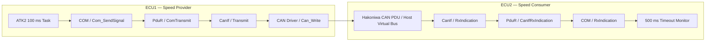

# SWE.2 — Software Architectural Design

## 1. Logical architecture



## 2. Deployment views

### Continuously tested host view

Two ECU objects execute in one deterministic process. This makes review and CI possible without proprietary compilers or Docker.

### Production-intent educational view

```text
ECU1 binary (RH850)       Hakoniwa Core       ECU2 binary (RH850)
ATK2 + A-COMSTACK  <---- CAN PDU route ----> ATK2 + A-COMSTACK
        | Athrill |                              | Athrill |
```

The upstream repository supplies ATK2-SC1, A-COMSTACK, A-RTEGEN, the RH850 GCC toolchain integration, Athrill device models, and Hakoniwa synchronization.

## 3. Interface contract

| Field | Value |
|---|---|
| CAN ID | `0x101` standard identifier |
| DLC | `3` |
| Byte 0 | speed LSB |
| Byte 1 | speed MSB |
| Byte 2 | rolling sequence counter |
| Cycle | 100 ms |
| Timeout | 500 ms |

## 4. Architectural decisions

| ADR | Decision | Reason |
|---|---|---|
| ADR-001 | Keep a host reference model beside the ATK2 backend. | A recruiter can run it in seconds; CI remains independent of heavy simulation tooling. |
| ADR-002 | Pin TOPPERS by commit. | Prevent upstream changes from invalidating evidence. |
| ADR-003 | Separate COM/PduR/CanIf/CAN functions even in the host model. | Preserve AUTOSAR Classic communication-stack reasoning and test points. |
| ADR-004 | Use simulation time, not wall-clock time. | Deterministic timeout verification. |
