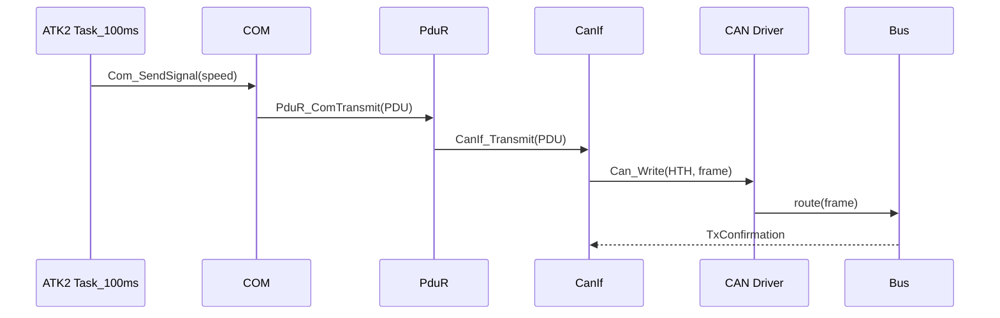
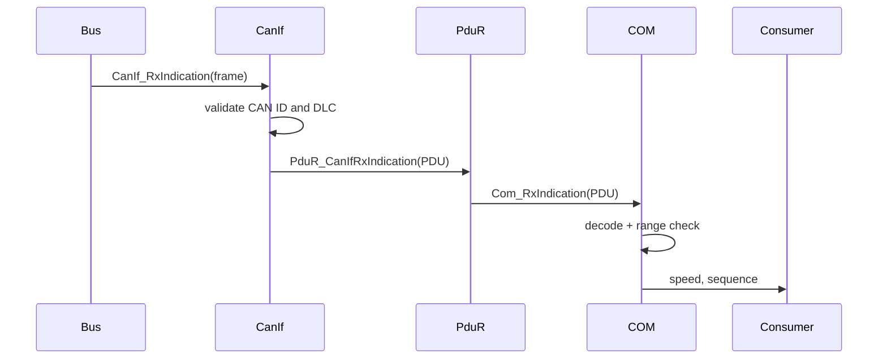

# SWE.3 — Software Detailed Design and Unit Construction

## 1. ECU1 transmit sequence



## 2. ECU2 receive sequence



## 3. Data encoding

```c
payload[0] = speed_kph & 0xFF;
payload[1] = (speed_kph >> 8) & 0xFF;
payload[2] = sequence_counter++;
```

## 4. Error handling

- Unexpected identifier: reject in CanIf; do not refresh timeout timestamp.
- Invalid DLC: reject in CanIf; do not access absent bytes.
- Implausible speed: reject in COM.
- Duplicate or out-of-order sequence: reject in COM when the counter is not newer than the last accepted counter; do not accept the payload and do not refresh the timeout timestamp. Forward gaps are tolerated as frame loss (indistinguishable without redundancy) and the receiver re-synchronizes on the next forward frame.
- Missing frame: latch one timeout event when age reaches 500 ms; clear latch after a new valid frame.

## 5. Source mapping

| Component | Host source | TOPPERS target |
|---|---|---|
| OS runnable | `src/ecu.c:Ecu1_100msTask` | ATK2 task/alarm configuration |
| COM | `Com_SendSignal`, `Com_RxIndication` | A-COMSTACK COM |
| PduR | `PduR_ComTransmit` and receive log point | A-COMSTACK PduR |
| CanIf | `CanIf_Transmit`, `Ecu2_CanIf_RxIndication` | A-COMSTACK CanIf |
| CAN | `Can_Write` | A-COMSTACK CAN driver |
| Physical/bus model | `src/virtual_can.c` | Athrill CAN device + Hakoniwa Core |
